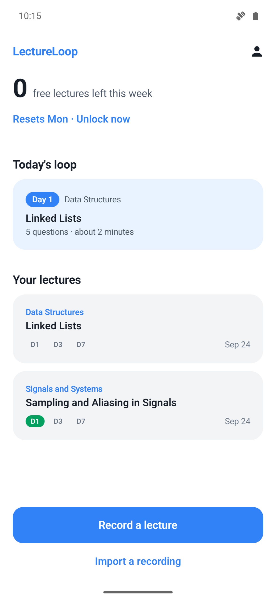
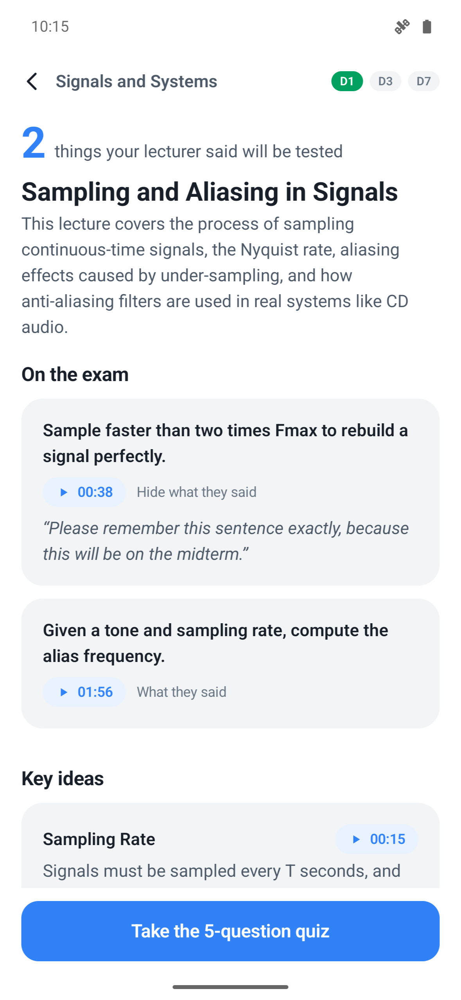
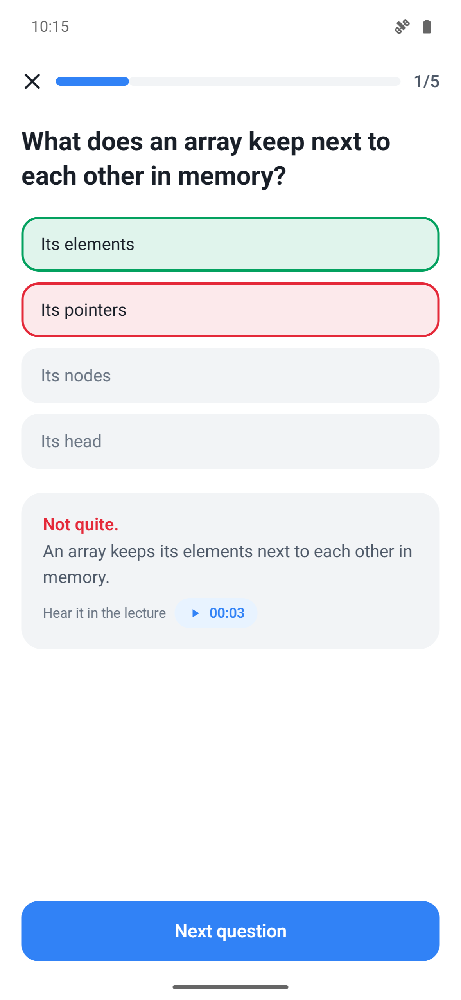

# LectureLoop

**Record the lecture. Leave the room with a 3-minute review. Get quizzed again on day 1, 3 and 7.**

LectureLoop is an Android app for students. Right after class it turns the recording into a review card — what the lecturer said will be on the exam (with the second they said it), the key ideas, and the homework with its deadline as spoken — and then brings a 5-question quiz back on day 1, 3 and 7 until the lecture sticks.

<p>



</p>

Built for the RevenueCat Shipaton 2026 **Next Gen Award** (student category). Demo video: _link added on submission_.

## Why

The forgetting curve starts the moment class ends, and the moment class ends is exactly when a student has the least time. I've been running a desktop version of this loop on my own classes this semester: it has turned 27 of my lectures across 5 courses into review pages since September 2026. LectureLoop is that loop rebuilt as a phone app anyone can use in the minute between two classes.

It is deliberately **not an AI summary**. It only keeps what the lecturer actually said, every item carries the timestamp it came from, and the app refuses cards that break its rules.

## How it works

```
 record in class ─┐                           ┌─ rules check (domain) ── fail ─┐
 (foreground svc) ├─ audio ─ Gemini, JSON ────┤  5 questions, 4 choices,       │ retry once with
 share / import  ─┘   response schema         │  timestamps inside recording   │ the violations
                      (10-min windows for     └─ pass ──────────────┐   ◄──────┘
                       long lectures)                               ▼
                         review card ── quiz now (practice) ── day 1 ── day 3 ── day 7 ── mastered
                                                               4/5 moves on · a miss repeats tomorrow
```

- **One multimodal call per window.** Gemini listens to the audio and must answer in a strict JSON schema (`responseSchema`): exam points with the lecturer's own words as the cue, 3–5 concepts, exactly 5 four-choice questions, to-dos with the deadline copied as spoken, and an `MM:SS` timestamp on every item.
- **Long lectures are cut into 10-minute windows.** We measured it: one call over a 74-minute recording put some timestamps 2–6 minutes away from the sentence and drew every question from the first 21 minutes. Windows analysed in parallel land every item within seconds of the sentence and cover the whole lecture ([VERIFICATION.md](docs/VERIFICATION.md)). The phone cuts M4A without re-encoding (MediaExtractor → MediaMuxer); the server uses `ffmpeg -c copy`. `CardMerger` (domain) shifts each window onto the lecture's timeline and picks items across it; it never creates a timestamp.
- **The domain decides, not the model.** `ReviewCardRules` rejects a card with the wrong number of questions or choices, an answer out of range, blank text, or a timestamp past the end of the recording. The use case retries once with the exact violations as feedback. Failed attempts never use the student's free allowance.
- **We never invent exam hints.** If the lecturer gave none, the card says so.
- **The loop.** `ReviewScheduler` brings the quiz back on day 1, 3 and 7. 4 of 5 moves the lecture on, a miss repeats it tomorrow, a late review keeps the gap instead of bunching reviews, and a quiz taken before it is due is practice that does not move the loop.

## RevenueCat

| What | How |
|---|---|
| Access | One entitlement, `pro`. The app never checks product IDs, so plans can change without an update. |
| Plans | Current offering, packages `$rc_six_month` (**Semester Pass**) and `$rc_monthly`. Prices always come from the store (`StoreProduct.price`); "save 33 % vs monthly" and the weekly price are computed in the domain (`PlanMath`), and only when currencies match. |
| Free allowance | 2 lectures a week by default, **set remotely** by the offering metadata key `free_lectures_per_week` (clamped 0–14). The paywall headline comes from metadata too (`headline`), so copy and allowance can be changed or A/B tested without a new build. |
| Server-side check | AI credits cost money per lecture, so the allowance cannot live only in the app. In server mode the phone holds **no AI key**: the LectureLoop server asks RevenueCat (`GET /v1/subscribers/{app_user_id}`, secret key) whether `pro` is active, enforces the weekly allowance per RevenueCat app user ID, and only then calls Gemini. If the server's count and the app's differ, the server wins and the app shows the paywall with the server's numbers. |
| Paywall | Custom Compose paywall — it has to show *this* student's situation ("2/2 free lectures used · resets Monday") and keep the recording that triggered it. It reports `trackCustomPaywallImpression` (paywall id `lectureloop-weekly-limit`) so conversion still shows up in RevenueCat, and **builds the waiting recording straight after the purchase**. |
| Purchase / restore | `awaitPurchase` with cancel treated as a normal outcome, `awaitRestore`, and an `UpdatedCustomerInfoListener` that refreshes the home screen. |
| Manage | RevenueCat **Customer Center** from the Account screen. |
| Environments | Debug builds use the **Test Store** key, release builds the Google Play key (`BuildConfig`, never both). |

**Why a Semester Pass?** A student's need has the shape of a term: it starts in week 1 and peaks at midterms and finals. A monthly plan asks the student to decide again in the middle of exams; a 6-month pass covers one term plus the break before the next one, which is how students budget. Monthly stays as the low-commitment entry.

## Architecture

Clean Architecture, enforced by the build: the inner layers are plain Kotlin/JVM modules, so they *cannot* import Android, RevenueCat or OkHttp — and the same rules run on the phone and on the server.

```
domain/            Timestamp, ReviewCard, ReviewCardRules, CardMerger, ReviewScheduler, QuizGrader, AccessPolicy, PlanMath
application/       BuildCard, ProcessLecture, TodayQueue, SubmitQuiz, AccessStatus, LoadPaywall/Purchase/Restore
                   ports: LectureAnalyzer, AudioSplitter, CardComposer, LectureRepository, BillingGateway, Clock, IdSource
adapters/gemini/   GeminiLectureAnalyzer (inline or resumable Files API), GeminiCardComposer, ProxyLectureAnalyzer, CardJson
server/            CardService (entitlement → allowance → BuildCard), RevenueCatRestEntitlements, FileUsageStore,
                   FfmpegAudioSplitter, HttpApi (JDK HttpServer, no framework)
app/               adapters: RevenueCatBilling, JsonLectureRepository, RecordingService, Mp4AudioSplitter, AudioImporter,
                   LecturePlayer · infrastructure: AppContainer (composition root) · ui: Jetpack Compose
```

The spec comes first: [`SPEC.md`](SPEC.md) lists the ubiquitous language, the use cases and the acceptance criteria that the tests are named after.

## Tests and verification

- **89 tests**: domain 39, application 25, Gemini adapters 10 (8 contract tests against a mock server + 2 live checks that run only on request), server 13 (1 needs `FFMPEG`), app adapters 2. `./gradlew check` — CI runs it on every push.
- `LayeringTest` fails the build if domain or application import a framework, SDK or `java.io.File`.
- Physical checks against the real API, the server and an emulator are written up in [`docs/VERIFICATION.md`](docs/VERIFICATION.md): a 2:28 lecture becomes a valid card in about 5–8 s with every timestamp within 2 s of an independent Whisper transcript; a 74-minute recording becomes a card in 14 s on the server (49 s on the phone, including the import) with every item in the right sentence.

## Run it

Requirements: JDK 21, Android SDK with platform 37, an emulator or phone on Android 8.0+.

**Server mode** (how it should ship — no AI key on the phone):

```bash
./gradlew :server:installDist
GEMINI_API_KEY=… REVENUECAT_SECRET_KEY=sk_… server/build/install/server/bin/server   # :8787, needs ffmpeg for long lectures
```
`local.properties`:
```properties
sdk.dir=/path/to/Android/sdk
LECTURELOOP_SERVER_URL=http://10.0.2.2:8787/     # emulator → your machine (debug builds allow this one cleartext host)
REVENUECAT_TEST_STORE_KEY=your-revenuecat-test-store-key
```

**Direct mode** (development): put `GEMINI_API_KEY=…` in `local.properties` instead of the server URL.

RevenueCat: entitlement `pro`; Test Store products for a 6-month Semester Pass and a monthly plan attached to `pro`; offering `default` with packages `$rc_six_month` and `$rc_monthly`; metadata `{"headline": "Keep every lecture in the loop", "free_lectures_per_week": 2}` — step by step in [`docs/REVENUECAT_SETUP.md`](docs/REVENUECAT_SETUP.md). Then `./gradlew installDebug`.

Without keys the app still builds and runs: cards cannot be built and the paywall explains which key is missing.

The 2-minute demo is recorded by a script (real app, real API calls): [`docs/DEMO.md`](docs/DEMO.md).

## Privacy

Recordings and cards stay on the phone. When you build a card, that one recording is sent (through the LectureLoop server in server mode) to Google Gemini to be analysed; long recordings go through Gemini's Files API and are deleted from it right after the call (instead of the default 48 hours); the server deletes its copy after the request and keeps only a count of cards per RevenueCat app user ID. Subscriptions use RevenueCat's anonymous app user ID. Record only where your school allows it.

## Known limits (next steps)

- Anonymous IDs: reinstalling the app gives a new RevenueCat anonymous ID and so a fresh free allowance. Sign-in or Play Integrity would close that; paid access is unaffected.
- The server keeps usage in one JSON file — fine for one instance, a database beyond that.
- Android only; the domain and application layers are plain Kotlin and are ready to move to Kotlin Multiplatform for iOS.
- Formats other than M4A are analysed in one call on the phone (the server cuts any format ffmpeg reads).

## License

[MIT](LICENSE)
